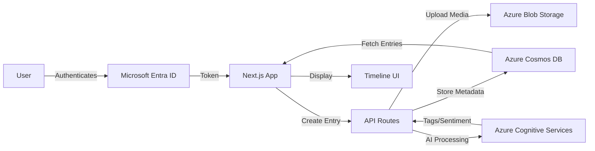

# 🕰️ Timeline of Me

**Timeline of Me** is a full-stack personal journaling web application that allows users to store and revisit memories using **text entries, images, and audio notes**, organized in a chronological timeline.

The project focuses on understanding full-stack workflows, cloud storage, and integrating external services into a real-world application.

[](https://azure.microsoft.com/services/app-service/static/)
[](https://nextjs.org/)
[](https://www.typescriptlang.org/)
[](LICENSE)

---

## 🌟 Features

- 📝 **Text, Image, and Audio Entries** - Create rich journal entries with multiple media types
- 📅 **Timeline View** - Chronological display of your life's moments
- 🔍 **Smart Search & Filtering** - Find past entries easily
- 🤖 **AI-Powered Features**:
  - Automatic image tagging
  - Audio transcription
  - Sentiment analysis
  - Intelligent categorization
- 🎨 **Beautiful UI** - Modern, responsive design with dark mode
- 🔐 **Secure Authentication** - OAuth with Microsoft Entra ID
- ☁️ **Cloud-Native** - Built on Azure services for scalability

---

## 🏗 Tech Stack

### Frontend
- **[Next.js 14](https://nextjs.org/)** - React framework with App Router
- **[TypeScript](https://www.typescriptlang.org/)** - Type-safe development
- **[Tailwind CSS](https://tailwindcss.com/)** - Utility-first styling
- **[Radix UI](https://www.radix-ui.com/)** - Accessible components
- **[Framer Motion](https://www.framer.com/motion/)** - Smooth animations

### Backend & Cloud
- **Next.js API Routes** - RESTful API endpoints
- **[Azure Blob Storage](https://azure.microsoft.com/services/storage/blobs/)** - Media file storage with SAS tokens
- **[Azure Cosmos DB](https://azure.microsoft.com/services/cosmos-db/)** - NoSQL database for entries
- **[Azure Cognitive Services](https://azure.microsoft.com/services/cognitive-services/)**:
  - Computer Vision for image analysis
  - Speech Services for audio transcription
  - Text Analytics for sentiment analysis

### Authentication & Deployment
- **[NextAuth.js](https://next-auth.js.org/)** with Microsoft Entra ID
- **[Azure Static Web Apps](https://azure.microsoft.com/services/app-service/static/)** - Serverless hosting

---

## 🚀 Quick Start

### Prerequisites

- Node.js 18+ and npm
- Azure account ([Create free account](https://azure.microsoft.com/free/))
- Git

### 1. Clone Repository

```bash
git clone https://github.com/YOUR-USERNAME/Cloud_Timeline.git
cd Cloud_Timeline/Cloud-Timeline
```

### 2. Install Dependencies

```bash
npm install
```

### 3. Set Up Environment Variables

```bash
# Copy environment template
cp .env.local.example .env.local
```

Edit `.env.local` and fill in your Azure credentials:
- See [**docs/ENVIRONMENT_SETUP.md**](docs/ENVIRONMENT_SETUP.md) for detailed instructions on setting up Azure services

### 4. Run Development Server

```bash
npm run dev
```

Open [http://localhost:3000](http://localhost:3000) in your browser.

---

## 📚 Documentation

- **[Environment Setup Guide](docs/ENVIRONMENT_SETUP.md)** - Step-by-step Azure service configuration
- **[Deployment Guide](DEPLOYMENT.md)** - Deploy to Azure Static Web Apps
- **[Contributing Guidelines](CONTRIBUTING.md)** - How to contribute to the project
- **[Architecture Overview](docs/ARCHITECTURE.md)** - System design and data flow

---

## 🔄 Application Flow



---

## 🛠️ Available Scripts

```bash
npm run dev          # Start development server
npm run build        # Build for production
npm run start        # Start production server
npm run lint         # Run ESLint
npm run lint:fix     # Fix linting issues
npm run type-check   # Run TypeScript type checking
npm run format       # Format code with Prettier
npm run validate-env # Validate environment variables
```

---

## 📁 Project Structure

```
Cloud-Timeline/
├── .github/workflows/     # GitHub Actions CI/CD
├── app/
│   ├── api/              # API routes
│   ├── dashboard/        # Dashboard page
│   ├── timeline/         # Timeline page
│   └── ...               # Other pages
├── components/
│   ├── ui/               # Reusable UI components
│   └── ...               # Feature components
├── lib/
│   ├── api-client.ts     # API client with error handling
│   ├── env.ts            # Environment validation
│   ├── constants.ts      # App-wide constants
│   └── ...               # Utility libraries
├── docs/                 # Documentation
├── scripts/              # Build/deployment scripts
├── .env.example          # Environment variables template
├── next.config.js        # Next.js configuration
└── staticwebapp.config.json  # Azure Static Web Apps config
```

---

## 🚀 Deployment

### Deploy to Azure Static Web Apps

1. **Set up Azure services** - Follow [docs/ENVIRONMENT_SETUP.md](docs/ENVIRONMENT_SETUP.md)
2. **Configure GitHub Secrets** - Add all environment variables
3. **Push to main branch** - Automatic deployment via GitHub Actions

See [**DEPLOYMENT.md**](DEPLOYMENT.md) for complete deployment instructions.

**Live Demo**: [Coming Soon]

---

## 🧠 What I Learned

- ✅ Building full-stack applications with Next.js 14 App Router
- ✅ Designing and consuming RESTful APIs
- ✅ Implementing file uploads with Azure Blob Storage
- ✅ Working with NoSQL databases (Cosmos DB)
- ✅ Integrating third-party authentication (OAuth)
- ✅ Using Azure Cognitive Services for AI features
- ✅ Managing environment variables and secrets
- ✅ Deploying to Azure Static Web Apps with CI/CD

---

## 🤝 Contributing

Contributions are welcome! Please read [CONTRIBUTING.md](CONTRIBUTING.md) for:
- Development setup
- Code standards
- Pull request process

---

## 📝 License

This project is licensed under the MIT License - see the [LICENSE](LICENSE) file for details.

---

## 🙏 Acknowledgments

- [Next.js](https://nextjs.org/) for the amazing React framework
- [Microsoft Azure](https://azure.microsoft.com/) for cloud services
- [Vercel](https://vercel.com/) for Next.js deployment insights
- [shadcn/ui](https://ui.shadcn.com/) for UI component inspiration

---

## 📧 Contact

For questions or feedback, please [open an issue](https://github.com/YOUR-USERNAME/Cloud_Timeline/issues).

---

**Built with ❤️ using Next.js and Azure**
